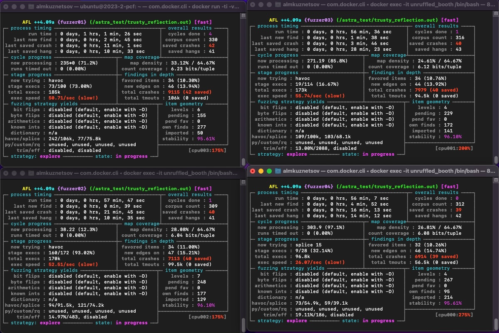

# Методика безопасной разработки
- Внедрение документирования разрабатываемого ПО.
- Внедрение тестирования разрабатываемого ПО.
- Внедрение в CI/CD статического анализа и динмаического анализа (фаззинг-тестирования)
- Определение ошибок по результатам статического и динамического анализа
- Оценка критичности обнаруженных ошибок, определение приоритетных ошибок для устранения. Составление плана устранения ошибок
- 
# Результаты фаззинг-тестирования AFL++
Артефакты фаззинг тестирования находятся в Github-репозитории в папке fuzz

Скриншот выполнения фаззинг-тестирования в 4 потока в течение часа: 

# Результаты статического анализа cppcheck
## bhaskara.c
### ERROR-1. Array `str[1]` accessed at index 1, which is out of bounds. [CWE-125: arrayIndexOutOfBounds](https://cwe.mitre.org/data/definitions/125.html)
```
bhaskara.c:70:12:
        str[i] = '\0';
           ^
bhaskara.c:61:13: note: Assignment 'i=0', assigned value is 0
    int i = 0;
            ^
bhaskara.c:69:13: note: i is incremented', new value is 1
        str[i++] = '0';
            ^
bhaskara.c:70:12: note: Array index out of bounds
        str[i] = '\0';
```

Способ устранения: вероятнее всего false positive, т.к. перед выполнением realloc есть `strlen++`, str будет состоять из двух элементов и будет возможность доступа к `str[1]`.

### ERROR-2. Common realloc mistake: 'str' nulled but not freed upon failure [CWE-401: memleakOnRealloc](https://cwe.mitre.org/data/definitions/401.html)
```
bhaskara.c:77:6:
     str = realloc(str,sizeof(char)*strlen);
     ^
```
Способ устранения: добавить обработку случая, когда realloc вернет `NULL`, т.к. не сможет выделить память

### ERROR-3. Common realloc mistake: 'str' nulled but not freed upon failure [CWE-401: memleakOnRealloc](https://cwe.mitre.org/data/definitions/401.html)
```
bhaskara.c:84:2:
 str = realloc(str,sizeof(char)*strlen);
 ^
```
Способ устранения: добавить обработку случая, когда realloc вернет `NULL`, т.к. не сможет выделить память

### ERROR-4. Memory is allocated but not initialized: env [CWE-665: uninitdata](https://cwe.mitre.org/data/definitions/665.html)
```
bhaskara.c:127:15:
  memcpy(arg, env, strlen(arg));
              ^
```
Способ устранения: инициализировать память, выделенную с помощью memcpy, например нулями: `memset(env, 0, 3);`

###  ERROR-5. Found a exit path from function with non-void return type that has missing return statement [CWE-772: missingReturn](https://cwe.mitre.org/data/definitions/772.html)
```
bhaskara.c:127:3:
  memcpy(arg, env, strlen(arg))
```
Способ устранения: добавить return в конце блока 125:127
### ERROR-6. Memory leak: env [memleak]
```
bhaskara.c:128:2:
 }
```
Способ устранения: аналогично с вышеупомянутыми ошибками в этом же блоке

### ERROR-7. Common realloc mistake: 'args' nulled but not freed upon failure [CWE-401: memleakOnRealloc](https://cwe.mitre.org/data/definitions/401.html)
```
bhaskara.c:143:3:
  args = realloc(args, sizeof(char)*strlen(argv[index])+"2");
  ^
```
Способ устранения: добавить обработку случая, когда realloc вернет `NULL`, т.к. не сможет выделить память


## clever_williams.c
### ERROR-8. Common realloc mistake: 'lst' nulled but not freed upon failure [CWE-401: memleakOnRealloc](https://cwe.mitre.org/data/definitions/401.html)
```
clever_williams.c:49:9:
        lst = realloc(lst, (sizelist + 1) * sizeof(*lst));
        ^
```
Способ устранения: добавить обработку случая, когда realloc вернет `NULL`, т.к. не сможет выделить память

### ERROR-9. Common realloc mistake: 'lst' nulled but not freed upon failure [CWE-401: memleakOnRealloc](https://cwe.mitre.org/data/definitions/401.html)
```
clever_williams.c:51:5:
    lst = realloc(lst, (sizelist = curlist + 1) * sizeof(*lst));
    ^
```
Способ устранения: добавить обработку случая, когда realloc вернет `NULL`, т.к. не сможет выделить память

### ERROR-10. Common realloc mistake: 'buf' nulled but not freed upon failure [CWE-401: memleakOnRealloc](https://cwe.mitre.org/data/definitions/401.html)
```
clever_williams.c:62:9:
        buf = realloc(buf, sizebuf += SIZE);
        ^
```
Способ устранения: добавить обработку случая, когда realloc вернет `NULL`, т.к. не сможет выделить память

### ERROR-11. Common realloc mistake: 'buf' nulled but not freed upon failure [CWE-401: memleakOnRealloc](https://cwe.mitre.org/data/definitions/401.html)
```
clever_williams.c:68:9:
        buf = realloc(buf, sizebuf += 1);
        ^
```
Способ устранения: добавить обработку случая, когда realloc вернет `NULL`, т.к. не сможет выделить память

### ERROR-12. Common realloc mistake: 'buf' nulled but not freed upon failure [CWE-401: memleakOnRealloc](https://cwe.mitre.org/data/definitions/401.html)
```
clever_williams.c:71:5: 
    buf = realloc(buf, sizebuf = curbuf);
    ^
```
Способ устранения: добавить обработку случая, когда realloc вернет `NULL`, т.к. не сможет выделить память

### ERROR-13. Common realloc mistake: 'lst' nulled but not freed upon failure [CWE-401: memleakOnRealloc](https://cwe.mitre.org/data/definitions/401.html)
```
clever_williams.c:74:9:
        lst = realloc(lst, (sizelist += SIZE) * sizeof(*lst));
        ^
```
Способ устранения: добавить обработку случая, когда realloc вернет `NULL`, т.к. не сможет выделить память

## kirch.c
### ERROR-14. Common realloc mistake: 'arglist' nulled but not freed upon failure [CWE-401: memleakOnRealloc](https://cwe.mitre.org/data/definitions/401.html)
```
kirch.c:241:3: 
  arglist = realloc(arglist,arglist_len*sizeof(char *));
  ^
```
Способ устранения: добавить обработку случая, когда realloc вернет `NULL`, т.к. не сможет выделить память

### ERROR-15. Common realloc mistake: 'arglist' nulled but not freed upon failure [CWE-401: memleakOnRealloc](https://cwe.mitre.org/data/definitions/401.html)
```
kirch.c:249:2: 
 arglist = realloc(arglist,arglist_len*sizeof(char *));
 ^
```
Способ устранения: добавить обработку случая, когда realloc вернет `NULL`, т.к. не сможет выделить память

### ERROR-16. Null pointer dereference: pi [CWE-476: nullPointer](https://cwe.mitre.org/data/definitions/476.html)
```
kirch.c:267:11:
 count = *pi;
          ^
kirch.c:266:7: note: Assignment 'pi=NULL', assigned value is 0
 pi = NULL;
      ^
kirch.c:267:11: note: Null pointer dereference
 count = *pi;
          ^
```
Способ устранения: перед выполнением разыменования добавить проверку на то, равен ли указатель нулю.

# Оценка критичности и план исправления
- Наиболее критичная, устранение в первую очередь: CWE-476 (ERROR-16)
- Средней критичности, устранение во вторую очередь: CWE-665 (ERROR-4)
- Низкой критичности, устранение по возможности: CWE-401 (ERROR-2, ERROR-3, ERROR-7 - ERROR-15), CWE-772 (ERROR-5)

# Pipeline
Статический анализ с помощью cppcheck внедрен в pipeline в репозитории на Github